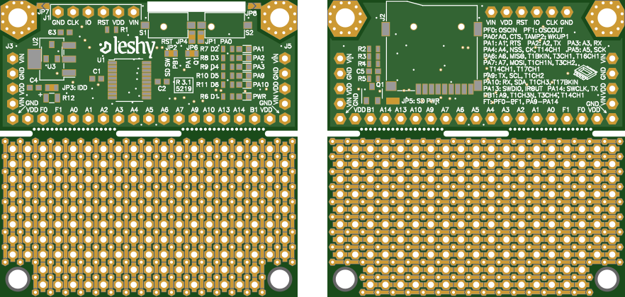

# leshy


[](./schematic.pdf)

This is a small breakout board for the STM32F030F4P6 microcontroller,
containing:

 - An LDO, alternatively a 1117-3.3 or a MCP1700-3302 (or compatible)
 - 6 LEDs, one as a power LED, the other 5 controllable by the controller
 - Two pushbuttons, one pre-connected to reset
 - A micro-SD slot with a MOSFET for turning its power off
 - A large prototyping area


## Demo projects

The subfolder `demo` contains some example code snippets for a quick start. Each
contains the necessary makefile for building and flashing, so no IDE has to be
installed in order to get started. However, the makefile is currently only
tested on linux.


### Flashing and debugging

The makefile currently supports two methods of flashing the controller: Either
[texane's st-link](https://github.com/texane/stlink) or OpenOCD can be used.
OpenOCD also allows debugging, so if the makefile detects a running OpenOCD
instance, it will automatically upload the firmware via OpenOCD. If there's
none running, it will fall back to `st-flash`.

Each project directory includes a OpenOCD script, so you just have to start
OpenOCD like:

```
$ openocd -f flash.cfg
```

As a matter of debugging, only text messages via semihosting are implemented so
far. These are displayed in OpenOCD. See the `debug-print` example for details.
Apart from that, of course `arm-none-eabi-gdb` or a complete IDE can be used.
