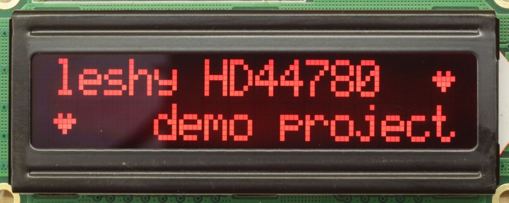

# 

This is a very basic driver implementation for HD44780-compatible LC displays in
4 bit mode. Delays are blocking for simplicity. Custom characters are supported
(as shown in the photo above). The used pins can be moved around freely in
`pinning.h`, but are constrained to port A. If they have to be moved to another
port, `LCD_Init()` and `LCD_Nibble()` have to be adapted accordingly.