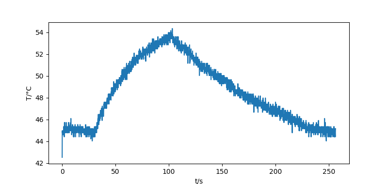

# SD card example

This example reads out the microcontroller's internal temperature sensor every
n milliseconds and saves the values to `log.csv` on the SD card. Logging is
stopped and started again by clicking the switch attached to PA0.

LED 3 (PA3) indicates ongoing initialisation, while LED 2 (PA2) is lit up as
long as logging is taking place. LED 5 (PA 10) flashes for every saved data
point. LED 1 (PA1) lights up when the SD card is turned off, since it is
connected to the same pin as the SD power MOSFET's gate.

The button should be pressed before removing the SD card, because the write
cache would not be flushed otherwise.

`plot.py` is a minimal Python script to plot a CSV file generated by the code
example.

## Some notes on the code
The code just is a quick port of ELM ChaN's FatFs and could be optimised in
terms of speed and size. The former can be achieved by disabling unneeded
features in `ffconf.h` such as long file names. For the latter an
implementation using the DMA for larger blocks instead of the currently used
blocking SPI transfer.
