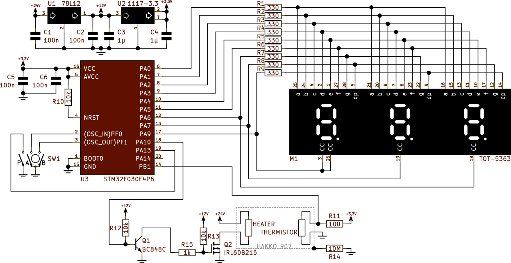
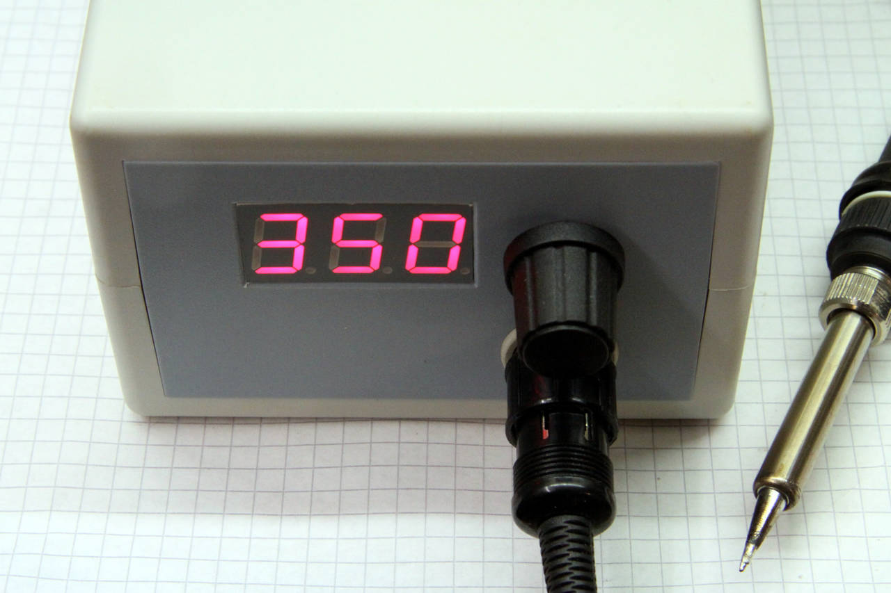
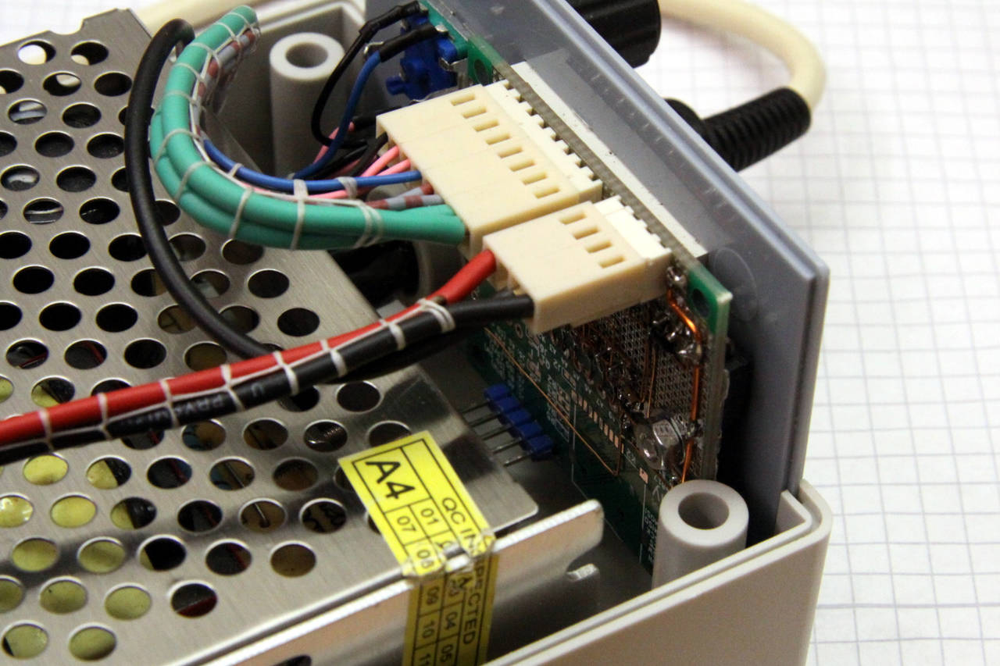

# Soldering iron controller example

This example is a simple controller for a Hakko-907-style soldering iron. It
features some components which are probably useful as a starting point for other
projects:

- Charlieplexed 3-digit 7-segment display
- Rotary encoder input
- Non-volatile storage in the controller's flash (with wear levelling)
- (Very basic) PID controller

## Schematic

Some notes on the circuit:

- The parts used here are just the ones I had lying around. Especially the
  MOSFET is _really_ oversized.
- R13 and R15 are deliberately smoothing the signal edges at the MOSFETs gate.
  This increases switching losses marginally, but also counteracts EM emissions.
- I'm getting away with connecting the base of Q1 directly to the PWM output
  because I'm using PA10 in open collector mode.
- The 7-segment displays are charlieplexed in order to save pins. Thus, it's
  very important to use a low current display, otherwise the MCU's outputs would
  be overloaded. If the displays are common cathode or common anode can be set
  in `display.h`.
- The encoder's pushbutton is not used at the moment. I thought about using it
  for a sleep or boost mode or something like that. It's important to note that
  using PA13 for that purpose will prevent you from debugging, because it's a
  pin used for SWD. You'll also have to flash the chip under reset.
- R14 connects the soldering iron's tip to PE for ESD purposes.

## Code

- `display.c`: As mentioned before, the display is charlieplexed. The pins can
  be adjusted flexibly in `pinning.h`, as long as they all are on the same GPIO
  port.
- `pid.c`: The PID controller is very basic. It has no filtering of the ADC
  samples or any advanced features. The control parameters were set empirically
  and are still a matter of improvement. All calculations are done with `float`s
  for clarity, because performance is not critical here.
- `nvs.c` helps keep the set temperature across power cycles by allowing storage
  in the controller's flash memory. A custom section defined in the linker
  script (`stm32f030f4_flash_15k_nvs_1k.ld`) is used completely for
  wear levelling.
- `config.h`: There are some basic temperature settings here and configuration
  for the timing behaviour of the display.

## Possible improvements

- Have some sort of standby mode (with an external sensor).
- Improve the control: Add some filtering, perhaps auto-tuning of the control
  parameters.

## What it could look like

