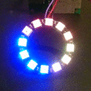

# SPI WS2812B example

This code snippet uses the SPI peripheral and the DMA of the controller to drive
a WS2812B RGB led strip. Some notes on that:

 - In order to match the timing for the LEDs, the controller clock frequency had
   to be lowered to 40 MHz, because the SPI peripheral is not very flexible in
   its clock frequency selection (it only allows prescalers 2^x).

 - The LED data pin is fixed to PA7, because the pin multiplexing does not allow
   any other one to be used for SPI MOSI.

 - The microSD cannot be used at the same time with this code driving an LED
   (strip).

 - The data line generally should have 5 V CMOS logic levels. The 3.3 V output
   of the controller often is satisfactory, but the may fail if the supply
   voltage of the LEDs exceeds some magic limit. As a solution for this issue,
   one can just use a single transistor (BJT or MOSFET) as an inverter,
   controlled by the controller and with a pull-up to 5 V connected to its
   collector/drain. Uncomment the define `LED_INVERT_DO` in `ws2812b_spi.h` to
   invert the data output software-side, thus leading to correct logic values at
   the WS2812B's data input.

 - The LEDs latch their received data when there is no transmission for at least
   50 µs. This code does not check if this time has passed before the start of
   the transmission of a new data frame. Just be sure that you do not call
   `LED_Refresh()` *right* after the last refresh is finished.

The example code includes a small animation on a 12 LED ring:

